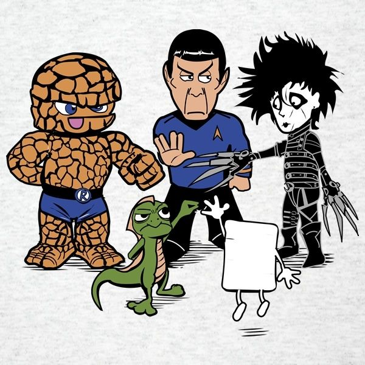

# Pedra, Papel ou Tesoura em Vue.js
Jogo - Pedra, Papel, Tesoura, Réptil ou Spock em Vue.js

Baseado no jogo em inglês Rock, Paper, Scissors, Lizard e Spock




## Rodando o projeto
```
yarn install
```

### Compilação para ambiente desenvolvimento
```
yarn dev
```

### Compilação para produção
```
yarn build
```

### Executar teste de unidade
```
yarn test:unit
```

### Corrigir problemas com arquivos lint
```
yarn lint
```
